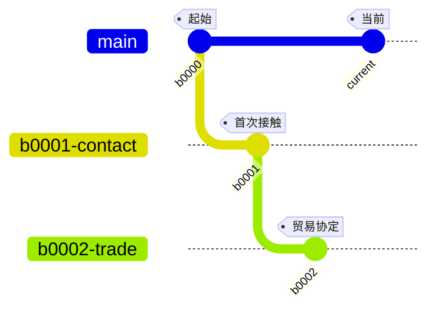

# GSimulator Web GUI — 技术设计文档

**日期**: 2026-06-21
**分支**: phase-http-api-completion
**状态**: 已确认

---

## 1. 概述

为 GSimulator 实现基于浏览器的 GUI，包含三大模块：

| 模块 | 功能 | 范围 |
|------|------|------|
| Agent 对话 | 多轮对话 + LLM 流式输出 + 分支上下文感知 | 基础交互 |
| 时间线分支 | 时间线主视图 + Mermaid 渲染 + 节点点击/切换 | 查看+切换 |
| 知识库搜索 | keyword/semantic 双模式搜索 + 结果列表 | 搜索+列表 |

桌面版三栏并排，移动版侧边栏切换。前后端不分离（HTMX + 服务端渲染），纯 Java 生态。

## 2. 技术选型

| 层 | 技术 | 理由 |
|----|------|------|
| 前端渲染 | HTMX 2.x (CDN) | 无构建工具，HTML 属性驱动交互 |
| 样式 | TailwindCSS (CDN) | 响应式布局，无构建 |
| 分支图 | Mermaid.js (CDN) | 声明式渲染 gitGraph/flowchart，点击交互 |
| 流式 | SSE (EventSource) + HTMX SSE 扩展 | 原生支持，复用现有 API |
| 模板引擎 | Thymeleaf 3.1 | Spring 生态标准，纯 HTML 模板 |
| HTTP 服务 | 独立 `WebUiServer`，端口 8711 | 与 API Server 隔离 |
| 构建 | Maven（无 npm/Node） | 与现有项目一致 |

## 3. 零依赖原则

不引入 Node.js、npm、webpack、vite 或任何前端构建工具。
所有前端依赖通过 CDN 加载：

```html
<script src="https://unpkg.com/htmx.org@2.0.4"></script>
<script src="https://unpkg.com/htmx.org@2.0.4/dist/ext/sse.js"></script>
<script src="https://cdn.jsdelivr.net/npm/mermaid@11/dist/mermaid.min.js"></script>
<link href="https://cdn.jsdelivr.net/npm/tailwindcss@2.2.19/dist/tailwind.min.css" rel="stylesheet">
```

## 4. 项目结构

```
src/main/java/com/gsim/webui/
├── WebUiServer.java              # 独立 HttpServer (:8711)
├── WebUiConfig.java              # 配置（host/port）
├── handlers/
│   ├── PageHandler.java          # 页面路由（/, /chat, /timeline, /knowledge）
│   ├── ChatHandler.java          # 对话 API（发送/SSE流/历史）
│   ├── TimelineHandler.java      # 时间线 API（数据/节点/切换）
│   ├── KnowledgeHandler.java     # 知识库搜索 API
│   └── StaticHandler.java        # 静态资源（CSS/JS/favicon）

src/main/resources/webui/
├── templates/
│   ├── index.html                # 主页面（HTML 骨架）
│   ├── chat-panel.html           # 对话面板片段
│   ├── timeline-panel.html       # 时间线面板片段
│   ├── knowledge-panel.html      # 知识库面板片段
│   └── fragments/
│       ├── message-bubble.html   # 消息气泡片段
│       ├── tool-call-card.html   # Tool call 状态卡片
│       ├── node-detail.html      # 节点详情片段
│       └── search-result.html    # 搜索结果行
└── static/
    └── app.js                    # 少量自定义 JS（Mermaid 初始化、侧边栏）

src/main/java/com/gsim/webui/templates/
├── MermaidRenderer.java          # 分支数据 → Mermaid 语法
└── TemplateRenderer.java         # Thymeleaf 模板渲染工具
```

## 5. 路由设计

### 5.1 页面路由（PageHandler）

| 方法 | 路径 | 说明 |
|------|------|------|
| GET | `/` | 主页面（完整 HTML） |
| GET | `/chat` | 对话面板 HTML 片段（hx-get 刷新） |
| GET | `/timeline` | 时间线面板 HTML 片段 |
| GET | `/knowledge` | 知识库面板 HTML 片段 |

### 5.2 对话 API（ChatHandler）

| 方法 | 路径 | 说明 |
|------|------|------|
| GET | `/chat/messages?sessionId=xxx&branchId=xxx` | 消息历史列表 |
| POST | `/chat/send` | 发送消息，返回 SSE 端点 |
| GET | `/chat/stream?taskId=xxx` | SSE 流式事件 |
| GET | `/chat/context?sessionId=xxx` | 当前分支上下文信息 |

### 5.3 时间线 API（TimelineHandler）

| 方法 | 路径 | 说明 |
|------|------|------|
| GET | `/timeline/data` | 分支树 JSON + Mermaid 语法 |
| GET | `/timeline/node?id=xxx` | 节点详情 HTML 片段 |
| POST | `/timeline/activate` | 切换活动分支 |
| POST | `/timeline/create` | 创建新子分支 |

### 5.4 知识库 API（KnowledgeHandler）

| 方法 | 路径 | 说明 |
|------|------|------|
| GET | `/knowledge/search?q=xxx&mode=keyword&topK=10` | 搜索 |
| POST | `/knowledge/search` | 搜索（POST body） |
| GET | `/knowledge/detail?id=xxx` | 结果详情 |

## 6. 页面布局

### 6.1 桌面版（≥768px）

```
┌──────────────┬──────────────────┬──────────────┐
│  时间线面板   │    对话面板       │  知识库面板   │
│  w-1/4       │    w-2/4         │  w-1/4       │
│              │                  │              │
│ [Mermaid 图] │ [当前分支上下文]  │ [搜索栏]     │
│ [刷新] [切换]│                  │ [mode 切换]  │
│              │ [消息列表        │              │
│ [节点列表]   │  - 用户消息      │ [结果列表]   │
│  - node 1   │  - LLM 流式回复  │  - 结果 1    │
│  - node 2   │  - Tool call     │  - 结果 2    │
│  - node 3   │  - 继续...]     │  - 结果 3    │
│              │                  │              │
│              │ [输入框    ]     │              │
│              │ [发送]          │              │
└──────────────┴──────────────────┴──────────────┘
```

### 6.2 移动版（<768px）

```
┌─────────────────────────────┐
│ [☰]  Agent 对话             │  ← 点击☰打开侧边栏
├─────────────────────────────┤
│                             │
│  当前选中模块的全屏内容      │
│                             │
└─────────────────────────────┘

侧边栏（overlay）：
┌────────────┐
│ × 关闭     │
│ ─────────  │
│ 💬 Agent   │
│ 🌳 时间线  │
│ 🔍 知识库  │
└────────────┘
```

## 7. 数据流

### 7.1 Agent 对话流程

```
1. 用户在输入框输入消息，点击发送
2. POST /chat/send { sessionId, message }
3. Java 端：
   a. 创建 ApiTask（通过 TaskManager）
   b. 在虚拟线程中调用 InteractionManager.handle(cmd, session)
   c. EventBus 发布 GSimEvent
4. 返回 { taskId, streamUrl: "/chat/stream?taskId=xxx" }
5. 前端：
   a. HTMX SSE 扩展连接 streamUrl
   b. sse:llm_delta → 更新流式文本块
   c. sse:llm_reasoning_delta → 更新 thinking 区域
   d. sse:tool_started/tool_done/tool_error → 渲染 tool call 卡片
   e. sse:command_done → 最终确定消息气泡
   f. sse:done → 断开 SSE 连接
```

### 7.2 时间线流程

```
1. 页面加载 → GET /timeline/data
2. Java 端：
   a. DataManager.getBranchChain(activeBranch) → 父链
   b. DataManager.getChildBranches() → 子分支
   c. MermaidRenderer → 生成 gitGraph 语法
3. 返回 JSON: { mermaid: "...", nodes: [...], activeBranchId: "..." }
4. 前端：mermaid.run() 渲染 SVG
5. 点击节点：
   a. GET /timeline/node?id=xxx → 节点详情 HTML
   b. hx-swap 替换详情面板
6. 切换分支：
   a. POST /timeline/activate { branchId }
   b. 刷新时间线和对话上下文
```

### 7.3 知识库搜索流程

```
1. 用户输入关键词，选择 mode
2. GET /knowledge/search?q=xxx&mode=keyword&topK=10
3. Java 端：
   a. KnowledgeSearchService.search(q, mode, topK)
   b. 返回 KnowledgeSearchResponse
4. 渲染结果 HTML 片段 → hx-swap 替换结果列表
5. 点击结果 → GET /knowledge/detail?id=xxx → 弹窗
```

## 8. SSE 事件 → UI 映射

| SSE Event | UI 行为 |
|-----------|---------|
| `command_started` | 显示新消息气泡（thinking 态） |
| `llm_reasoning_delta` | 追加到 reasoning 折叠区（灰色，小字） |
| `llm_delta` | 逐 token 追加到消息正文 |
| `tool_started` | 插入 tool call 卡片（loading 态） |
| `tool_done` | 更新 tool call 卡片（完成态，显示结果摘要） |
| `tool_error` | 更新 tool call 卡片（错误态，红色） |
| `command_done` | 锁定消息气泡，不再更新 |
| `command_error` | 显示错误消息 |
| `done` | 断开 SSE，恢复发送按钮 |

## 9. Mermaid 时间线渲染策略

使用 Mermaid `gitGraph` 语法模拟时间线分支：



- 主分支（main）沿时间线主轴
- 子分支从对应节点分出
- 活动分支高亮
- 点击节点通过 CSS `click` 事件 + `hx-get` 触发

## 10. 线程模型

```
WebUiServer (:8711)
    └── VirtualThreadPerTaskExecutor
        ├── 页面请求 → 同步返回 HTML
        ├── 搜索请求 → 同步返回 JSON
        └── SSE 连接 → 异步保持连接，EventBus 驱动写入
```

- 页面渲染复用现有 `ApplicationContext` 的所有 services
- SSE 流式通过 `FilteredEventSink` 订阅 `EventBus`
- 与现有 ApiManager (:8710) 共享底层组件，不重复实例化

## 11. 样式方案

使用 TailwindCSS CDN（v2），响应式断点：

| 断点 | 布局 |
|------|------|
| `<768px` (md) | 移动端：单面板 + 侧边栏 |
| `≥768px` | 桌面端：三栏 w-1/4 + w-2/4 + w-1/4 |

**黑色主题**（与 CLI 一致）：深色背景（gray-900）、终端绿色强调（green-400）、等宽字体消息区。

## 12. Maven 依赖变更

仅新增一个依赖：

```xml
<dependency>
    <groupId>org.thymeleaf</groupId>
    <artifactId>thymeleaf</artifactId>
    <version>3.1.3.RELEASE</version>
</dependency>
```

## 13. 启动方式

```bash
# 启动完整 GUI（CLI + API + WebUI）
java -jar target/GSimulator.jar --http --webui

# 仅 WebUI
java -jar target/GSimulator.jar --webui

# 开发模式（WebUI 独立调试，API 默认端口）
java -jar target/GSimulator.jar --http --webui
# 浏览器访问 http://127.0.0.1:8711
```

通过环境变量配置：
- `WEBUI_HOST` — 默认 127.0.0.1
- `WEBUI_PORT` — 默认 8711
- `WEBUI_ENABLED` — 默认 false

## 14. 实现阶段

| Phase | 内容 | 产出 |
|-------|------|------|
| Phase 1 | WebUiServer + Thymeleaf 骨架 + 主页面布局 | 可访问 `:8711`，三栏布局空壳 |
| Phase 2 | Agent 对话面板（SSE 流式 + 消息历史 + 输入） | 可对话，流式显示 |
| Phase 3 | 时间线分支面板（Mermaid + 节点详情 + 切换） | 可视化分支，可点击切换 |
| Phase 4 | 知识库搜索面板（双模式搜索 + 结果列表） | 搜索功能完整 |
| Phase 5 | 移动端适配（侧边栏 + 响应式） | 移动端可用 |
| Phase 6 | 集成测试 + 启动集成 | 完整验收 |
